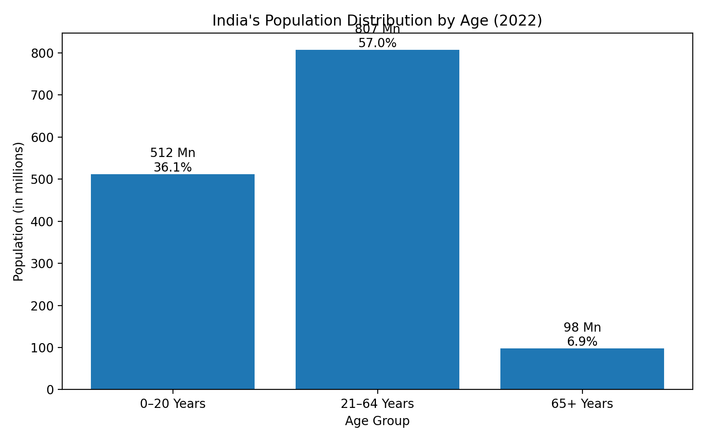

# SCT_DS_TASK1
# SkillCraft Internship – Data Visualization

This repository contains my work completed during the **Web Development Internship at SkillCraft Technology**.  
The code demonstrates the use of **Python (Pandas + Matplotlib)** for data analysis and visualization.

---

## 📌 Task 01: Population Distribution by Age
We created a **bar chart** to visualize India's population distribution by age groups (2022).

### Dataset
The dataset (`india_age_distribution_2022.csv`) includes:
- Age Group
- Population (in millions)
- Percentage

### Visualization
The script (`population_chart.py`) reads the dataset and generates the chart:

### Insights
- 0–20 years: 512 million (36.1%)  
- 21–64 years: 807 million (57.0%)  
- 65+ years: 98 million (6.9%)  

Most of the population (57%) is in the working-age group, highlighting India’s young demographic profile.

---

## 🚀 Tech Stack
- Python  
- Pandas  
- Matplotlib  

---

## 📂 Internship
This project is part of my internship work at **SkillCraft Technology** (Web Development Internship).
